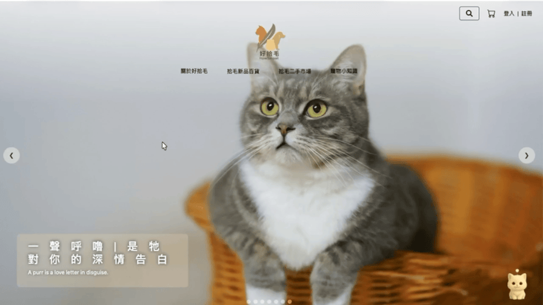
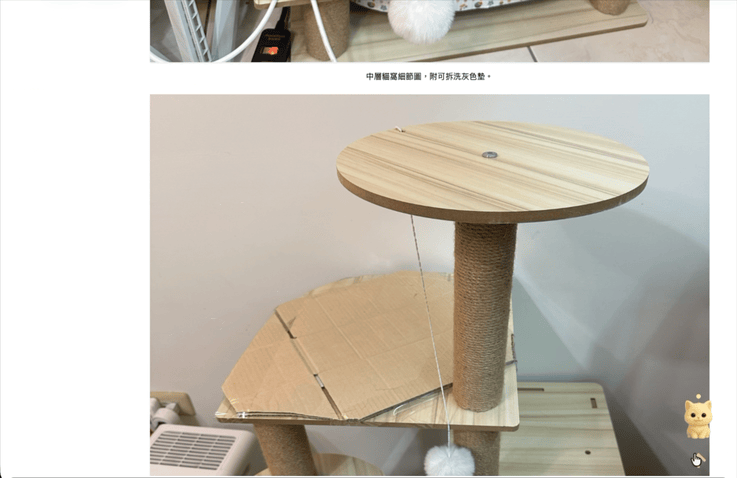
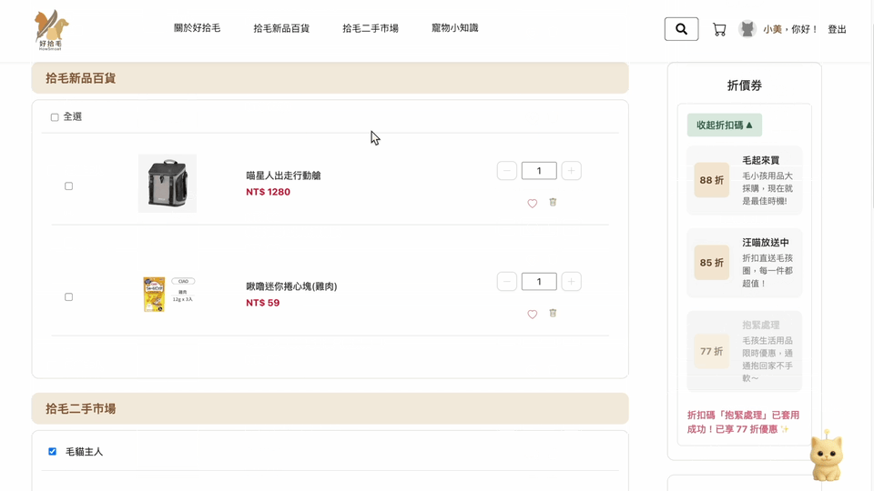
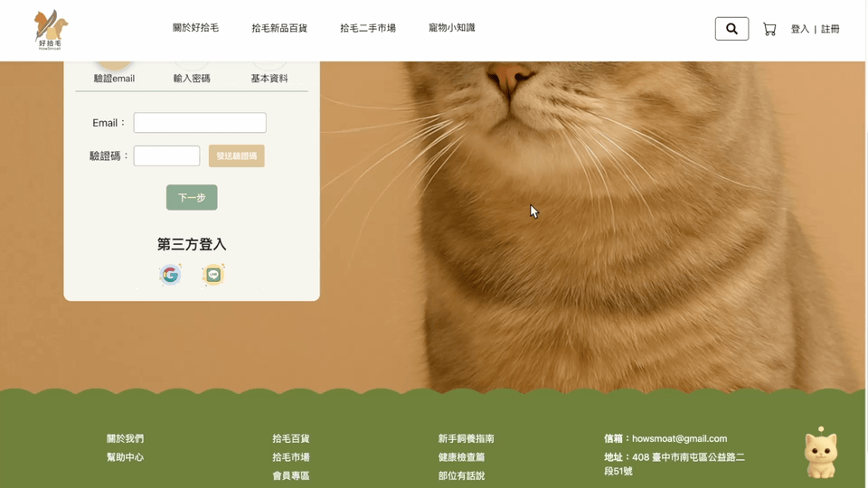
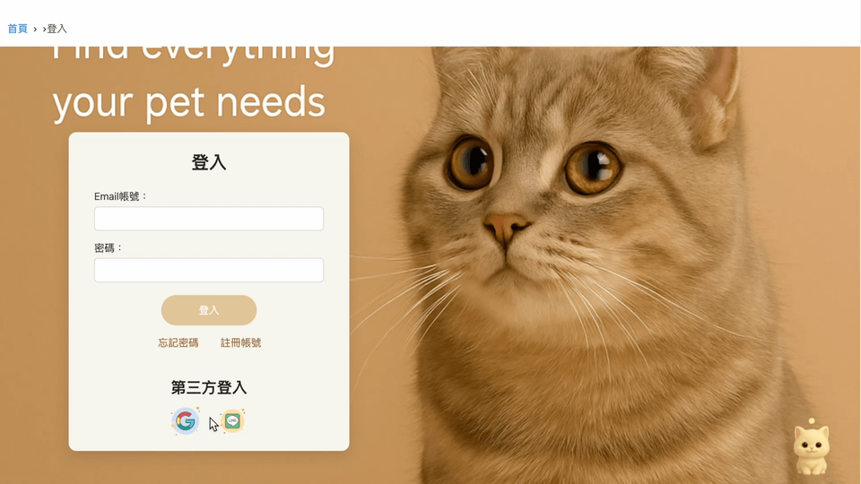

## 🐾 好拾毛｜寵物用品電商網站
本 README 主要展示我於此專案中負責開發的功能模組與操作流程。

  

「好拾毛」是一個結合寵物用品購物與飼養知識的互動平台，提供新品與二手商品販售及寵物知識專區，幫助飼主快速取得商品與飼養資訊。
本專案使用 React 搭配 Node.js 開發寵物電商網站，實作商品展示、購物車、會員系統與完整購物流程，並串接後端 API 與 MySQL 資料庫，完成完整購物流程。

## ✨ Features

---

### 📦 商品資訊頁

  

> - 顯示商品圖片、規格與庫存資訊
> - 顯示賣家資訊與商品／賣家評論
> - 支援加入購物車與收藏功能

---

### 🛒 購物車與結帳流程

  

  

> - 商品加入購物車、數量調整與刪除
> - 未登入使用 localStorage，登入後自動同步購物車
> - 商品勾選與結帳流程處理
> - 填寫送貨、付款與發票資訊
> - 儲存配送與載具資料供下次快速帶入
> - 串接綠界 ECPay 金流與 7-11 超商門市選取功能
> - 建立訂單並同步更新商品庫存

---

### 🔐 第三方登入

  

---

### 🔐 忘記密碼

  

> - 忘記密碼與密碼重設流程
> - Gmail OAuth2 驗證寄信

---

## 🛠 Tech Stack

> Frontend：React / Bootstrap / Axios  
> Backend：Node.js / Express / MySQL  
> Services：ECPay / Gmail OAuth2 / Google Login / Line Login

---

## 📌 本專案僅作為學習與作品展示用途，無任何商業使用。
